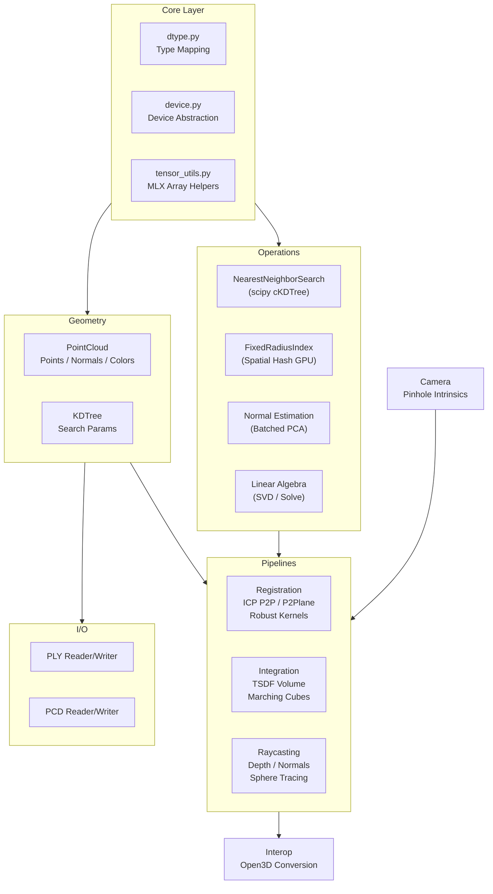
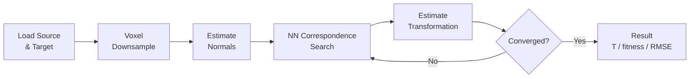
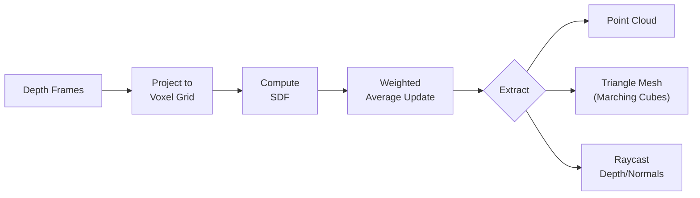
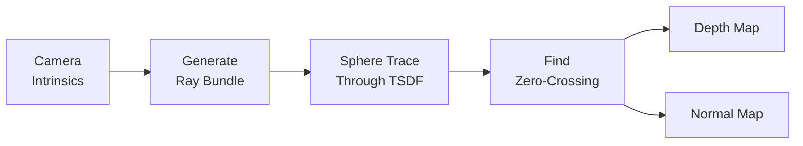
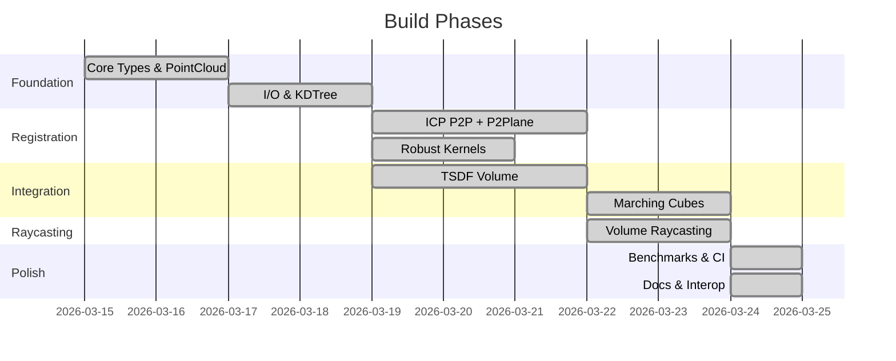

<p align="center">
  <strong>Open3D-MLX</strong><br>
  <em>Apple Silicon-native 3D perception pipelines, powered by MLX</em>
</p>

<p align="center">
  
  
  
  
  
</p>

---

A focused port of [Open3D](https://github.com/isl-org/Open3D)'s GPU-accelerated pipelines to Apple Silicon via [MLX](https://github.com/ml-explore/mlx). ICP registration, TSDF integration, raycasting, and point cloud I/O -- all running natively on Metal with zero C++ compilation.

**Built by [AIFLOW LABS](https://aiflowlabs.io) / [RobotFlow Labs](https://robotflowlabs.com).**

---

## Architecture



---

## Pipeline Deep-Dives

### ICP Registration



### TSDF Integration



### Volume Raycasting



---

## Build Phase Timeline



---

## Project Stats

| Metric | Value |
|--------|-------|
| Source files | 42 |
| Test files | 41 |
| Source lines | 7,480 |
| Test lines | 6,837 |
| Tests passing | 572 |
| Tests skipped | 7 (optional open3d interop) |
| Benchmark files | 7 (30 benchmarks) |
| Examples | 8 working scripts |
| PRDs | 13 completed |
| Commits | 8 |

## Module Overview

| Module | Description | Key Features |
|--------|-------------|-------------|
| `open3d_mlx.core` | Dtype mapping, device abstraction, tensor utilities | float64/int64 auto-downcast, MLX array helpers |
| `open3d_mlx.geometry` | `PointCloud`, `AxisAlignedBoundingBox`, KDTree params | Transforms, voxel/uniform/random/farthest downsampling, crop, normals, outlier removal |
| `open3d_mlx.io` | Point cloud file I/O | PLY, PCD, XYZ, PTS (ASCII + binary) |
| `open3d_mlx.ops` | GPU-accelerated primitive operations | FixedRadiusIndex (spatial hash), NearestNeighborSearch (KDTree), batched PCA normals |
| `open3d_mlx.camera` | Camera models | PinholeCameraIntrinsic with K matrix |
| `open3d_mlx.pipelines.registration` | ICP registration pipeline | P2P, P2Plane, Colored ICP, GICP, multi-scale, 5 robust kernels, FPFH features, correspondence checkers |
| `open3d_mlx.pipelines.integration` | TSDF volume reconstruction | UniformTSDFVolume, ScalableTSDFVolume (hash-based), marching cubes mesh extraction |
| `open3d_mlx.pipelines.raycasting` | Volume raycasting | Adaptive sphere-tracing, depth/normal map rendering, trilinear interpolation |
| `open3d_mlx.interop` | Open3D bridge | `to_open3d()`, `from_open3d()`, `to_open3d_tensor()` |

---

## Quick Start

### Installation

```bash
# Clone
git clone https://github.com/RobotFlow-Labs/open3d-mlx.git
cd open3d-mlx

# Install with uv (recommended)
uv pip install -e ".[dev]"

# Or with pip
pip install -e ".[dev]"
```

### Requirements

- Python >= 3.10
- macOS with Apple Silicon (M1/M2/M3/M4)
- MLX >= 0.22.0

### ICP Registration

```python
import open3d_mlx as o3m

# Load point clouds
source = o3m.io.read_point_cloud("scan_001.ply")
target = o3m.io.read_point_cloud("scan_002.ply")

# Downsample and estimate normals
source_down = source.voxel_down_sample(0.02)
target_down = target.voxel_down_sample(0.02)
source_down.estimate_normals(
    search_param=o3m.geometry.KDTreeSearchParamHybrid(radius=0.1, max_nn=30)
)
target_down.estimate_normals(
    search_param=o3m.geometry.KDTreeSearchParamHybrid(radius=0.1, max_nn=30)
)

# Run ICP (GPU-accelerated on Apple Silicon)
result = o3m.pipelines.registration.registration_icp(
    source_down, target_down,
    max_correspondence_distance=0.05,
    estimation_method=o3m.pipelines.registration.TransformationEstimationPointToPlane(),
)

print(f"Fitness: {result.fitness:.4f}")
print(f"RMSE:    {result.inlier_rmse:.4f}")
aligned = source.transform(result.transformation)
```

### TSDF Integration

```python
import open3d_mlx as o3m

# Create TSDF volume
volume = o3m.pipelines.integration.UniformTSDFVolume(
    length=4.0, resolution=512, sdf_trunc=0.04
)

# Integrate depth frames
for depth, pose in depth_frames:
    volume.integrate(depth, intrinsic, pose)

# Extract geometry
pcd = volume.extract_point_cloud()
mesh = volume.extract_triangle_mesh()
```

### Interop with Open3D

```python
from open3d_mlx.interop import to_open3d, from_open3d
import open3d as o3d

# Compute on MLX, visualize with Open3D
aligned = source.transform(result.transformation)
o3d.visualization.draw_geometries([to_open3d(aligned), to_open3d(target)])
```

---

## What Makes This Special

### Unified Memory -- No Copies

On Apple Silicon, CPU and GPU share the same memory. There is no `tensor.cuda()` or `tensor.cpu()`. Your data is just *there*, on both processors, always.

```python
points = mx.array(numpy_points)  # Lives in unified memory
# No .to(device) needed -- ever
```

### Zero-Wrapper Tensor Design

Open3D wraps tensors in `o3d.core.Tensor`. We skip the wrapper entirely. An `mlx.core.array` **is** the tensor. This means zero overhead, zero abstraction layers, and full compatibility with the MLX ecosystem.

### API-Compatible with Open3D

If you know Open3D, you know Open3D-MLX. Same function names, same parameter signatures, same result structures. Switch your import and go.

### Pure Python + MLX

No C++ compilation step. No CMake. No CUDA toolkit. Install with `pip` and run. MLX handles the Metal GPU dispatch under the hood.

---

## Migration from Open3D

| Operation | Open3D | Open3D-MLX |
|-----------|--------|------------|
| Import | `import open3d as o3d` | `import open3d_mlx as o3m` |
| Read point cloud | `o3d.io.read_point_cloud(f)` | `o3m.io.read_point_cloud(f)` |
| Create point cloud | `o3d.geometry.PointCloud()` | `o3m.geometry.PointCloud()` |
| ICP registration | `o3d.pipelines.registration.registration_icp(...)` | `o3m.pipelines.registration.registration_icp(...)` |
| TSDF volume | `o3d.pipelines.integration.UniformTSDFVolume(...)` | `o3m.pipelines.integration.UniformTSDFVolume(...)` |
| Tensor type | `numpy.ndarray` or `o3d.core.Tensor` | `mlx.core.array` |
| Device transfer | `tensor.cuda()` / `tensor.cpu()` | Not needed (unified memory) |
| Visualization | Built-in | Use Open3D or polyscope via `interop` |
| Primary dtype | `float64` | `float32` |

### Key Differences

1. All tensors are `mlx.core.array`, not `numpy` or `o3d.core.Tensor`
2. No `.to(device)` calls -- unified memory on Apple Silicon
3. No built-in visualization -- use Open3D or polyscope (see interop)
4. `float32` is the primary dtype, not `float64`
5. Convert when needed: `np.array(mlx_result)` for NumPy, `to_open3d(pcd)` for visualization

---

## Running Tests

```bash
# All tests
pytest tests/

# Specific module
pytest tests/test_pipelines/test_registration/ -v

# With coverage
pytest tests/ --cov=open3d_mlx
```

## Benchmarks

Performance comparisons against Open3D CUDA are tracked in `benchmarks/`:

```bash
pytest benchmarks/ -v
```

---

## Upstream Sync

This project ports from [isl-org/Open3D](https://github.com/isl-org/Open3D) (12k+ stars). The upstream source is available at `repositories/open3d-upstream/` for reference.

We target the **tensor-based** (`t/`) implementations -- those are Open3D's GPU-optimized paths:

```
cpp/open3d/t/pipelines/registration/   --> open3d_mlx/pipelines/registration/
cpp/open3d/t/geometry/RaycastingScene   --> open3d_mlx/pipelines/raycasting/
cpp/open3d/pipelines/integration/       --> open3d_mlx/pipelines/integration/
cpp/open3d/core/nns/                    --> open3d_mlx/ops/
cpp/open3d/geometry/KDTreeFlann         --> open3d_mlx/ops/nearest_neighbor.py
```

---

## Project Structure

```
open3d_mlx/
  core/                # MLX tensor wrapper, device, dtypes
  geometry/            # PointCloud, KDTree search params
  io/                  # PLY/PCD file I/O
  camera/              # Pinhole camera intrinsics
  ops/                 # NN search, normals, linalg
  pipelines/
    registration/      # ICP variants, robust kernels
    integration/       # TSDF volume, marching cubes
    raycasting/        # Volume raycasting
  interop.py           # Open3D conversion helpers
tests/                 # 572 tests mirroring source structure
benchmarks/            # 30 benchmarks (ICP, TSDF, NN, I/O, PointCloud)
examples/              # 8 working example scripts
prds/                  # 13 build PRDs with dependency graph
```

---

## Contributing

Contributions are welcome. The project follows a focused scope -- see [PROMPT.md](PROMPT.md) for what is and is not in scope.

```bash
# Setup
git clone https://github.com/RobotFlow-Labs/open3d-mlx.git
cd open3d-mlx
uv pip install -e ".[dev]"

# Run tests before submitting
pytest tests/

# Code style
ruff check open3d_mlx/ tests/
ruff format open3d_mlx/ tests/
```

---

## License

Apache License 2.0. See [LICENSE](LICENSE) for details.

Open3D-MLX is a derivative work of [Open3D](https://github.com/isl-org/Open3D), also licensed under Apache 2.0.

---

<p align="center">
  <sub>Built with MLX on Apple Silicon by <a href="https://robotflowlabs.com">RobotFlow Labs</a></sub>
</p>
